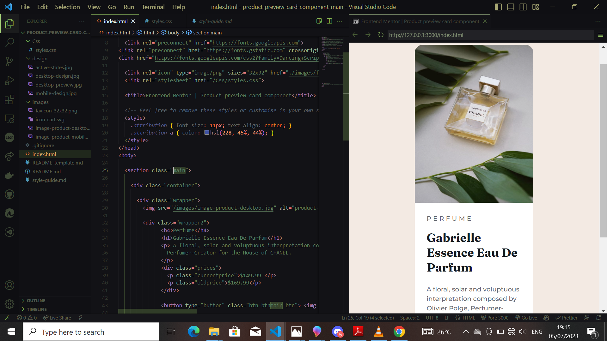
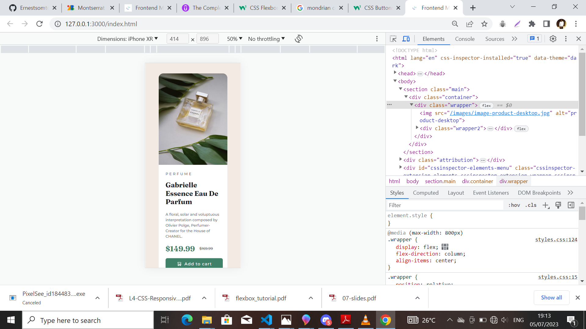

# Frontend Mentor - Product preview card component solution

This is a solution to the [Product preview card component challenge on Frontend Mentor](https://www.frontendmentor.io/challenges/product-preview-card-component-GO7UmttRfa). Frontend Mentor challenges help you improve your coding skills by building realistic projects. 

## Table of contents

- [Overview](#Product-component-card)
  - [The challenge](#Build a product preview component card )
  - [Screenshot](#screenshot)
  - [Links](#links)
- [My process](#my-process)
  - [Built with](#built-with)
- [Author](#Author)
  

## Overview
Product preview component card

### The challenge
Responsive product preview component card

Users should be able to:

- View the optimal layout depending on their device's screen size
- See hover and focus states for interactive elements

### Screenshot
This are some screenshot images to my solution

### Links
Deployed to Netlify on the link below

- Solution URL: [Netlify](https://leafy-blancmange-2911f6.netlify.app)

## My process
Since it's a very simple layout, i figured to use only Css flex to achieve the desire outcome since it's fairly more easier to manage.

CSS3 and HTML5

### Built with

- Semantic HTML5 markup
- CSS custom properties
- Flexbox
- Desktop-first workflow

## Author

- Website - [Ernest somto Michael](https://github.com/Ernestsomto)
- Frontend Mentor - [@Ernestsomto](https://www.frontendmentor.io/profile/Ernestsomto)
- Twitter - [@Leronernest](https://www.twitter.com/Leronernest)

